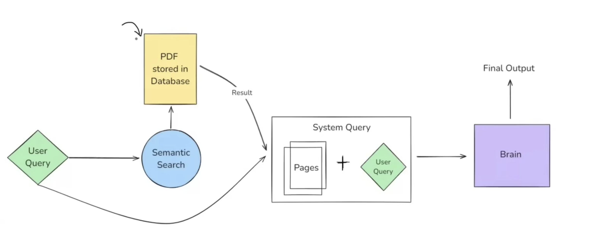
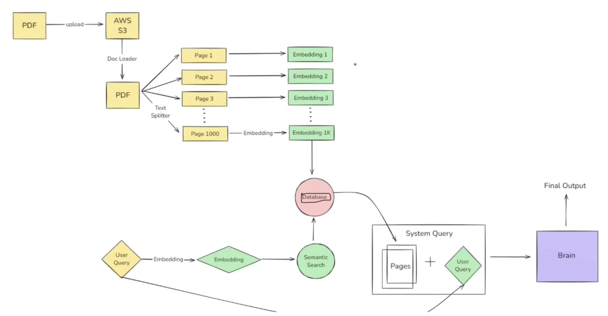

# LangChain Introduction - Complete Guide

## What is LangChain?

**LangChain is an open-source framework for developing applications powered by LLMs (Large Language Models).**

If you want to build any LLM-based application, LangChain is the framework that helps you build that application efficiently.

## Why Do We Need LangChain?

### Real-World Example: PDF Chat Application (2014 Vision)

#### The Original Idea
Back in 2014, the concept was to build an application where users could:
- Upload PDF documents
- Read the PDFs within the app
- **Chat with their PDFs** using a chat feature
- Ask questions like:
  - "Explain page 5 like I'm a 5-year-old"
  - "Generate true/false questions on Linear Regression"
  - "Create notes on Decision Trees from this book"

This type of application would be incredibly useful as it combines reading with interactive questioning.

### High-Level System Architecture

#### Basic Workflow:
1. **Document Upload**: User uploads PDF → Store in database (e.g., AWS S3)
2. **Query Processing**: User asks a question about the content
3. **Search Operation**: Find relevant pages/sections in the document
4. **Response Generation**: Generate contextual answers based on found content

#### The Search Challenge: Keyword vs Semantic Search

**Keyword Search Problems:**
- Searches for exact word matches
- Returns too many irrelevant results
- Example: Searching "advantages of linear regression" returns all pages with "advantages" or "linear regression" separately

**Semantic Search Solution:**
- Understands the **meaning** of the query
- Returns contextually relevant results
- Focuses on "advantages of linear regression" as a complete concept
- More efficient and meaningful results

### Detailed System Design

#### Step-by-Step Process:

1. **Document Loading**
   - Use a **Document Loader** to import PDF from cloud storage
   - Load document into the system for processing

2. **Text Chunking**
   - Use a **Text Splitter** to divide document into smaller chunks
   - Can split by: chapters, pages, paragraphs
   - Example: 1000-page PDF → 1000 separate chunks

3. **Embedding Generation**
   - Use an **Embedding Model** to convert each chunk into vectors
   - Each page becomes an n-dimensional vector (set of numbers)
   - Vectors capture semantic meaning of text content

4. **Vector Storage**
   - Store all embeddings in a **Vector Database**
   - Enables future querying and similarity search

5. **Query Processing**
   - Convert user query into embedding using same model
   - Compare query vector with stored document vectors
   - Find most similar chunks (e.g., top 5 most relevant pages)

6. **Response Generation**
   - Combine user's original query + relevant pages
   - Send to the system's "Brain" (LLM component)
   - Generate contextual response based on retrieved content

### The "Brain" Component Requirements

The system's brain needs two key capabilities:

1. **Natural Language Understanding (NLU)**
   - Understand queries in multiple languages (English, Hindi, etc.)
   - Comprehend user intent and context

2. **Context-Aware Text Generation**
   - Read provided document pages
   - Extract relevant information
   - Generate human-like responses based on context

## Major Challenges and Solutions

### Challenge 1: Building the "Brain"
**Problem:** Creating a component with NLU and text generation capabilities was extremely difficult in 2014-2015.

**Solution:** Modern **Large Language Models (LLMs)** solve this problem:
- GPT-4, Claude, Gemini have both NLU and text generation capabilities
- No need to build from scratch - use existing LLMs

### Challenge 2: LLM Infrastructure Management
**Problem:** Running LLMs requires:
- Massive computational resources (GPUs)
- Complex engineering for deployment
- High infrastructure costs
- Scaling challenges

**Solution:** **LLM APIs** solve the infrastructure problem:
- Companies like OpenAI, Anthropic host LLMs on their servers
- Provide API access to LLM capabilities
- Pay-per-use pricing model
- No infrastructure management required

### Challenge 3: System Orchestration
**Problem:** Coordinating multiple moving components:
- **5 Major Components:**
  1. AWS S3 (document storage)
  2. Text Splitter (chunking model)
  3. Embedding Model (vector generation)
  4. Vector Database (storage)
  5. LLM API (response generation)

- **6 Major Tasks:**
  1. Document loading
  2. Text splitting
  3. Embedding generation
  4. Database management
  5. Retrieval operations
  6. LLM communication

**The Core Problem:** Managing this complex system manually requires extensive boilerplate code and becomes extremely difficult when requirements change (e.g., switching from OpenAI to Google's models).

**Solution:** **This is where LangChain comes in!**

## How LangChain Solves the Orchestration Problem

LangChain provides:
- **Built-in functionalities** for all common LLM application patterns
- **Plug-and-play architecture** for easy component swapping
- **Abstraction layer** that handles component interactions
- **Reduced boilerplate code** for complex workflows

Instead of manually coding all component interactions, LangChain handles the orchestration behind the scenes, letting you focus on your application logic.

## Key Benefits of LangChain

### 1. Chains Concept
- **What it is:** Connect different components and tasks in a pipeline
- **How it works:** Output of one component automatically becomes input of the next
- **Advanced features:**
  - Complex chains with multiple branches
  - Parallel execution chains
  - Conditional chains based on logic
  - Highly expressive pipeline creation

### 2. Model Agnostic Development
- **Flexibility:** Use any LLM model without code changes
- **Easy switching:** Change from OpenAI to Google or Anthropic with minimal code modification
- **Focus on logic:** Concentrate on business logic rather than model-specific implementations

### 3. Complete Ecosystem
**Document Loaders:** Support for various formats
- Cloud storage integration
- Local file loading
- PDF, Word, text files
- Multiple data source connectors

**Text Splitters:** 50+ different splitting strategies
- Page-based splitting
- Paragraph-based splitting
- Semantic chunking
- Custom splitting logic

**Embedding Models:** Wide variety of options
- OpenAI embeddings
- Google embeddings
- Open-source alternatives
- Custom embedding models

**Vector Databases:** Multiple database integrations
- Pinecone, Weaviate, Chroma
- Traditional databases with vector support
- Cloud and local options

### 4. Memory and State Management
**Conversation Memory:**
- Maintains context across multiple queries
- Example scenario:
  - User: "What are the advantages of linear regression?"
  - System: [provides answer]
  - User: "Also give me interview questions on this algorithm"
  - System: Understands "this algorithm" refers to linear regression

**State Persistence:**
- Maintains application state across sessions
- Handles complex conversation flows
- Supports multi-turn interactions

## What Can You Build with LangChain?

### 1. Conversational Chatbots
**Use Case:** Customer service automation
- **Problem:** Scaling customer support is expensive and challenging
- **Solution:** AI chatbots handle first-level customer interactions
- **Benefits:** 
  - 24/7 availability
  - Instant responses
  - Cost-effective scaling
  - Human escalation when needed

### 2. AI Knowledge Assistants
**Use Case:** Domain-specific question answering
- **Example:** Educational platform integration
  - Students watching lectures can ask questions
  - Chatbot has access to course content
  - Provides contextual answers based on current lesson
- **Applications:**
  - Corporate knowledge bases
  - Educational content assistance
  - Technical documentation helpers

### 3. AI Agents
**Definition:** "Chatbots on steroids" - they don't just chat, they perform actions

**Example Use Case:** Travel booking assistant
- **Target Users:** Senior citizens who struggle with complex websites
- **Functionality:**
  - Natural conversation: "Book me the cheapest flight from X to Y on this date"
  - **Action execution:** Actually books the flight through integrated systems
  - **Tool integration:** Has access to booking APIs and payment systems

**Why Important:** AI Agents are considered the "next big thing" in AI

### 4. Workflow Automation
- **Personal level:** Automate daily tasks and routines
- **Professional level:** Streamline business processes
- **Company level:** Enterprise workflow optimization

### 5. Summarization and Research Helpers
**Problems Solved:**
- **Context length limitations:** Process documents larger than ChatGPT's limits
- **Privacy concerns:** Handle confidential company data without external APIs

**Solutions:**
- **Custom ChatGPT-like tools** for organizations
- **Unlimited document processing** capabilities
- **Private data handling** within company infrastructure
- **Research paper analysis** and summarization

## LangChain Alternatives

### 1. LlamaIndex
- Popular framework for LLM applications
- Strong focus on data indexing and retrieval
- Good for document-heavy applications

### 2. Haystack
- Enterprise-focused NLP framework
- Comprehensive pipeline management
- Strong search and QA capabilities

### Comparison Note
The choice between frameworks depends on:
- **Pricing and cost considerations**
- **Specific use case requirements**
- **Team expertise and preferences**
- **Integration needs with existing systems**

LangChain currently has broader adoption and community support, making it a popular choice for most LLM application development.

## Key Takeaways

### Why LangChain Matters:
1. **Simplifies Complexity:** Handles the orchestration of multiple AI components
2. **Accelerates Development:** Reduces time from concept to production
3. **Provides Flexibility:** Easy to experiment and iterate with different models
4. **Industry Standard:** Widely adopted framework with strong community support

### The Future of LLM Applications:
- **Similar to previous tech booms:** Just as we saw web applications boom, then mobile apps boom, we're now seeing the **LLM-based applications boom**
- **LangChain's Role:** Positioned to play a key role in this transformation
- **Opportunity:** Early adoption of LangChain skills provides competitive advantage

### Learning Path:
This introduction sets the theoretical foundation. Next steps involve:
1. Understanding LangChain's complete ecosystem
2. Hands-on coding and application building
3. Building production-ready LLM applications

---

**Bottom Line:** LangChain transforms the complex task of building LLM applications from months of infrastructure work into days of application logic development, making advanced AI capabilities accessible to developers across skill levels.
