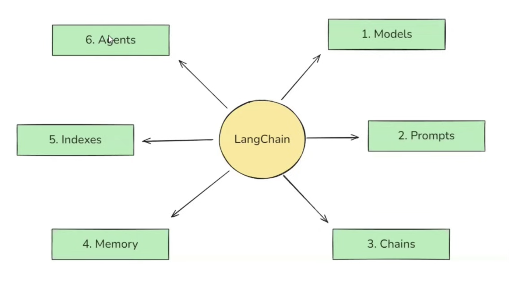

# LangChain Components - Complete Guide

## Introduction
This guide covers the **6 core components** of LangChain framework that make building LLM-powered applications efficient and scalable. Understanding these components is crucial as they form the foundation of all LLM application development using LangChain.


## The 6 Core Components

### 1. Models
### 2. Prompts  
### 3. Chains
### 4. Indexes
### 5. Memory
### 6. Agents

---

## 1. Models Component

### **What is the Models Component?**
**Models are the core interface through which you interact with AI models in LangChain.**

### **Problem it Solves: API Standardization Challenge**

#### **The Historical Context**
- **Early Challenge:** Building chatbots required solving two major problems:
  1. **Natural Language Understanding (NLU)** - Making chatbots understand user queries
  2. **Context-aware Text Generation** - Making chatbots generate meaningful responses

- **LLM Revolution:** Large Language Models solved both problems simultaneously by training on massive internet data

- **New Challenge:** LLMs became huge (100GB+) making them impossible to run locally for most users

- **API Solution:** Companies like OpenAI, Anthropic created APIs to provide LLM access without infrastructure burden

#### **The Standardization Problem**
Different LLM providers created different API interfaces:

**OpenAI API Example:**
```python
from openai import OpenAI
client = OpenAI()
response = client.chat.completions.create(...)
```

**Anthropic Claude API Example:**
```python
from anthropic import Anthropic
client = Anthropic()
message = client.messages.create(...)
```

**Problems with Different APIs:**
- Different code required for each provider
- Switching providers meant rewriting entire codebase
- Different response formats
- No standardization across platforms

### **How Models Component Solves This**

LangChain provides a **standardized interface** for all LLM providers:

**LangChain with OpenAI:**
```python
from langchain_openai import ChatOpenAI
llm = ChatOpenAI()
result = llm.invoke("Your query")
```

**LangChain with Claude:**
```python
from langchain_anthropic import ChatAnthropic
llm = ChatAnthropic()
result = llm.invoke("Your query")
```

**Key Benefits:**
- **Minimal code changes** when switching providers (literally 2 lines)
- **Consistent response format** across all providers
- **Same programming interface** regardless of underlying model
- **Easy A/B testing** between different models

### **Types of Models Supported**

#### **1. Language Models (LLMs)**
- **Functionality:** Text input → Text output
- **Use Cases:** Chatbots, AI agents, text generation
- **Examples:** GPT-4, Claude, Gemini

#### **2. Embedding Models**
- **Functionality:** Text input → Vector output  
- **Use Cases:** Semantic search, similarity matching
- **Applications:** Document retrieval, recommendation systems

### **Supported Providers**
LangChain supports numerous providers including:
- **OpenAI** (GPT models)
- **Anthropic** (Claude models)
- **Google** (Gemini, Vertex AI)
- **AWS** (Bedrock)
- **Hugging Face**
- **Mistral AI**
- **IBM Watson**

---

## 2. Prompts Component

### **What are Prompts?**
**Prompts are inputs provided to LLMs - essentially the questions or instructions you give to AI models.**

### **Why Prompts are Critical**
- **High Sensitivity:** Small changes in prompts can dramatically alter LLM outputs
- **Example:** 
  - "Explain linear regression in academic tone" 
  - vs "Explain linear regression in fun tone"
  - → Completely different responses despite one word change

### **The Rise of Prompt Engineering**
- **New Field:** Prompt Engineering has emerged as a specialized discipline
- **Job Profile:** Prompt Engineers are now in high demand
- **Importance:** Proper prompting is crucial for LLM application success

### **Problem it Solves: Prompt Management Complexity**

Without proper tools, managing prompts becomes chaotic:
- Hard-coded prompts in applications
- No reusability across different scenarios
- Difficult to maintain and update
- No dynamic prompt generation

### **How Prompts Component Helps**

LangChain provides powerful prompt management capabilities:

#### **1. Dynamic and Reusable Prompts**
```python
# Template with placeholders
template = "Summarize this {topic} in {emotion} tone"

# Dynamic usage
prompt1 = template.format(topic="cricket", emotion="fun")
prompt2 = template.format(topic="biology", emotion="serious")
```

#### **2. Role-Based Prompting**
```python
# System level prompt
system_prompt = "You are an experienced {profession}"

# User level prompt  
user_prompt = "Tell me about {topic}"

# Dynamic combination
doctor_query = system_prompt.format(profession="doctor") + user_prompt.format(topic="viral fever")
engineer_query = system_prompt.format(profession="engineer") + user_prompt.format(topic="bridge development")
```

#### **3. Few-Shot Prompting**
```python
# Provide examples to guide model behavior
examples = [
    "I was charged twice for my subscription this month -> Billing Issue",
    "The app crashes every time I try to log in -> Technical Issue", 
    "Can you explain how to upgrade my plan -> General Inquiry"
]

# New query classification based on examples
new_query = "How do I cancel my subscription?"
# Model learns from examples to classify new queries
```

### **Key Benefits**
- **Template System:** Create reusable prompt templates
- **Dynamic Generation:** Generate prompts based on user input
- **Role-Based Prompts:** Assign specific roles/personas to AI
- **Few-Shot Learning:** Provide examples for better results
- **Easy Maintenance:** Centralized prompt management

---

## 3. Chains Component

### **What are Chains?**
**Chains are LangChain's way of building pipelines that connect multiple components together.**

The name "LangChain" itself comes from this concept of chaining components!

### **Problem it Solves: Complex Workflow Management**

#### **Real-World Example: English to Hindi Summary App**
**Requirement:** Convert 1000-word English text → Hindi summary in <100 words

**Without Chains (Manual Approach):**
1. Take user input
2. Send to LLM #1 for English to Hindi translation
3. Get translated text
4. Manually pass translated text to LLM #2  
5. Get Hindi summary from LLM #2
6. Return final result

**Problems:**
- Manual data passing between stages
- Complex error handling
- Difficult to modify pipeline
- Lots of boilerplate code

### **How Chains Solve This**

**With Chains:**
```
Input → LLM1 (Translation) → LLM2 (Summarization) → Output
```

**Key Benefits:**
- **Automatic Data Flow:** Output of one stage becomes input of next
- **No Manual Coding:** Chain handles data passing automatically  
- **Pipeline Simplicity:** Define workflow, let chain execute
- **Easy Modifications:** Add/remove stages without major rewrites

#### **Types of Chains**

### **1. Sequential Chains**
Simple linear workflow: A → B → C

### **2. Parallel Chains**
Multiple parallel processes that combine results:

**Example: Detailed Report Generation**
```
Input: "911 Incident"
    ↓
LLM1 → Report A
    ↓
LLM2 → Report B    → LLM3 (Combiner) → Final Combined Report
    ↓
Input (same)
```

### **3. Conditional Chains**  
Different processing based on conditions:

**Example: Feedback Processing System**
```
User Feedback Input
    ↓
LLM (Sentiment Analysis)
    ↓
If Positive → Send "Thank You" message
If Negative → Alert customer support team + Send apology
```

### **Key Advantages**
- **Pipeline Architecture:** Build complex workflows easily
- **Automatic Flow Management:** No manual data passing required
- **Flexible Design:** Sequential, parallel, and conditional flows
- **Reusable Components:** Mix and match different chain types
- **Error Handling:** Built-in error management across pipeline stages

---

## 4. Indexes Component

### **What are Indexes?**
**Indexes connect your application to external knowledge sources like PDFs, websites, and databases.**

### **The Core Problem: Limited Knowledge Base**

#### **ChatGPT Limitation Example**
ChatGPT can answer: "Who is the Prime Minister of India?" ✅
ChatGPT cannot answer: "What is the leave policy of XYZ company?" ❌

**Why?** ChatGPT doesn't have access to private/company-specific data.

### **Solution: External Knowledge Integration**

Connect LLMs to external knowledge sources so they can answer questions about:
- Company policies and documents  
- Private databases
- Recent information (post-training cutoff)
- Domain-specific content

### **The 4 Components of Indexes**

#### **1. Document Loaders**
- **Purpose:** Load documents from various sources
- **Sources:** Cloud storage (AWS S3), local files, websites, databases
- **Formats:** PDF, Word, text files, web pages

#### **2. Text Splitters** 
- **Purpose:** Break large documents into manageable chunks
- **Methods:** By pages, paragraphs, chapters, semantic boundaries
- **Example:** 1000-page PDF → 1000 individual chunks

#### **3. Vector Stores**
- **Purpose:** Store document embeddings for semantic search
- **Process:** Convert text chunks → vector embeddings → store in database
- **Technologies:** Pinecone, Chroma, Weaviate, FAISS

#### **4. Retrievers**
- **Purpose:** Find relevant information based on user queries
- **Process:** Query → embedding → similarity search → relevant chunks

### **Complete Workflow Example**

**Scenario:** Company policy chatbot for XYZ Corp

**Setup Phase:**
1. **Document Loader:** Load company policy PDF from cloud storage
2. **Text Splitter:** Split 1000-page document into 1000 page chunks  
3. **Embedding:** Convert each page to vector using embedding model
4. **Vector Store:** Store all 1000 vectors in vector database

**Query Phase:**
1. **User Query:** "What is the leave policy of XYZ company?"
2. **Retriever:** Convert query to vector → search similar vectors in database
3. **Results:** Find top 5 most relevant pages about leave policy
4. **LLM Integration:** Send relevant pages + query to LLM
5. **Response:** LLM generates answer based on retrieved company documents

### **Key Benefits**
- **Private Data Access:** Query proprietary company information
- **Up-to-date Information:** Access recent documents beyond training data
- **Domain Expertise:** Build specialized knowledge bases
- **Flexible Sources:** Support multiple document types and sources

---

## 5. Memory Component

### **What is Memory?**
**Memory enables LLMs to remember conversation history and maintain context across interactions.**

### **The Stateless Problem**

#### **Core Issue:** 
**LLM API calls are stateless** - each request is independent with no memory of previous interactions.

#### **Example of the Problem:**
```
Request 1: "Who is Narendra Modi?"
Response 1: "Narendra Modi is an Indian politician who is the current Prime Minister of India"

Request 2: "How old is he?"  
Response 2: "As an AI, I don't have access to personal data about individuals unless it has been shared with me"
```

**Problem:** The LLM forgot the context from Request 1, so it doesn't know who "he" refers to in Request 2.

### **Why This is Critical**

**Imagine building a chatbot without memory:**
- Users would need to repeat context in every message
- Conversations would be frustrating and inefficient  
- No natural dialogue flow
- Poor user experience

### **How Memory Component Solves This**

Memory component maintains conversation context by:

#### **1. Conversation Memory**
- **Stores** previous messages in the conversation
- **Maintains context** across multiple turns
- **Enables natural dialogue** flow

#### **Example with Memory:**
```
Turn 1: 
User: "What are the advantages of linear regression?"
AI: [Provides detailed answer about linear regression advantages]

Turn 2:
User: "Also give me interview questions on this algorithm"  
AI: [Understands "this algorithm" refers to linear regression from Turn 1]
```

#### **2. State Management**
- **Persistent state** across conversation sessions
- **Context awareness** for complex multi-turn interactions
- **Smart context handling** for long conversations

### **Types of Memory**

#### **1. Buffer Memory**
- Stores recent conversation history
- Simple FIFO (First In, First Out) approach
- Good for short conversations

#### **2. Summary Memory**  
- Summarizes old conversations to save space
- Maintains key information while reducing token usage
- Suitable for long conversations

#### **3. Entity Memory**
- Remembers specific entities mentioned in conversation
- Tracks relationships and attributes
- Advanced context maintenance

### **Key Benefits**
- **Natural Conversations:** Enable flowing, contextual dialogue
- **Better User Experience:** Users don't need to repeat information
- **Context Continuity:** Maintain conversation thread across multiple interactions
- **Efficient Processing:** Smart memory management to optimize token usage

---

## 6. Agents Component

### **What are Agents?**
**Agents are AI systems that can not only chat but also perform actions using external tools.**

### **Evolution: From Chatbots to Agents**

#### **Traditional Chatbots:**
- **Capability:** Only text-based conversations
- **Limitation:** Cannot perform external actions
- **Example:** Customer service bot that only provides information

#### **AI Agents:**  
- **Enhanced Capability:** Chat + Action execution
- **Tool Integration:** Can use external APIs and services
- **Example:** Travel booking agent that actually books flights

### **Real-World Agent Example: Travel Booking Assistant**

**Target Users:** Senior citizens who struggle with complex booking websites

**Agent Capabilities:**
```
User: "Book me the cheapest flight from Delhi to Mumbai on December 15th"

Agent Process:
1. Understands the request (NLU)
2. Searches flight APIs for available options  
3. Compares prices across airlines
4. Selects cheapest option
5. Processes booking through payment APIs
6. Confirms booking with user
7. Sends confirmation details
```

**Key Difference:** The agent doesn't just provide flight information - it actually completes the booking!

### **Agent Architecture**

#### **Core Components:**
1. **Reasoning Engine:** Decides what actions to take
2. **Tool Access:** Can call external APIs and services  
3. **Memory:** Maintains context of tasks and conversations
4. **Planning:** Can break complex tasks into sub-tasks

#### **Types of Tools Agents Can Use:**
- **Web Search:** Browse internet for information
- **Database Queries:** Access and retrieve data
- **API Calls:** Integrate with external services
- **File Operations:** Read, write, and manipulate files
- **Calculations:** Perform mathematical operations

### **Agent Workflow Example**

**Complex Task:** "Plan a weekend trip to Goa"

**Agent Breakdown:**
1. **Research Phase:**
   - Search for Goa attractions
   - Check weather forecast
   - Find hotel options

2. **Planning Phase:**  
   - Create day-wise itinerary
   - Calculate budget requirements
   - Identify transportation options

3. **Booking Phase:**
   - Book flight tickets
   - Reserve hotel rooms  
   - Schedule activity bookings

4. **Coordination Phase:**
   - Send itinerary to user
   - Set calendar reminders
   - Provide contact information

### **Why Agents are Important**

#### **Industry Significance:**
- **Next Big Thing:** Agents are considered the next major advancement in AI
- **Business Impact:** Automate complex workflows that previously required human intervention  
- **User Experience:** Provide end-to-end solutions rather than just information

#### **Key Advantages:**
- **Action-Oriented:** Actually execute tasks, not just provide information
- **Tool Integration:** Seamlessly work with multiple external systems
- **Complex Problem Solving:** Handle multi-step workflows automatically
- **24/7 Availability:** Provide continuous service without human intervention

---

## Summary: Why These Components Matter

### **Integrated Solution**
LangChain's 6 components work together to solve different aspects of LLM application development:

1. **Models:** Standardize AI model interactions
2. **Prompts:** Manage and optimize AI instructions  
3. **Chains:** Build complex workflows and pipelines
4. **Indexes:** Connect to external knowledge sources
5. **Memory:** Enable contextual conversations
6. **Agents:** Create action-capable AI systems

### **Development Benefits**
- **Reduced Complexity:** Handle complex orchestration automatically
- **Faster Development:** Pre-built components accelerate building
- **Flexibility:** Mix and match components for different use cases
- **Scalability:** Enterprise-ready architecture patterns
- **Maintainability:** Modular design makes updates easier

### **Real-World Impact**
These components enable building production-ready applications like:
- **Intelligent Customer Service** (Memory + Prompts + Models)
- **Document Analysis Systems** (Indexes + Chains + Models)  
- **AI-Powered Workflows** (Agents + Chains + Memory)
- **Knowledge Management Platforms** (All components integrated)

**Bottom Line:** LangChain's component architecture transforms complex LLM application development from months of custom coding into days of component configuration and integration.
