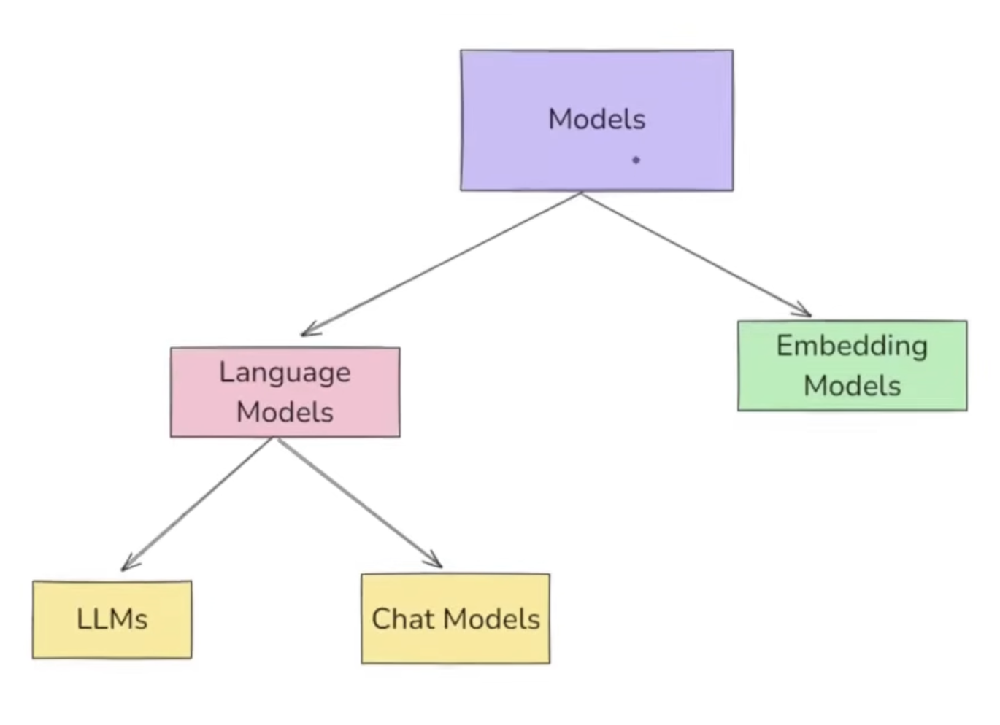

# LangChain Models Component - Complete Tutorial


## Introduction
This README covers the **Models Component** of LangChain with practical code implementations. The Models component is the **core interface** through which you interact with AI models in LangChain, providing a standardized way to work with different AI model providers.

## What is the Models Component?

**The Models component in LangChain is a crucial part of the framework designed to facilitate interactions with various Language Models and Embedding Models.**

### Key Purpose
- **Standardized Interface**: Provides a common interface to interact with different AI model providers
- **Easy Provider Switching**: Switch between different AI models with minimal code changes
- **Consistent Response Handling**: Unified response format across different providers

## Types of Models in LangChain

### 1. Language Models
**Text Input → Text Output**
- Used for: Chatbots, text generation, code generation, Q&A systems
- Examples: GPT-4, Claude, Gemini

### 2. Embedding Models  
**Text Input → Vector Output (Numbers)**
- Used for: Semantic search, document similarity, RAG-based applications
- Purpose: Convert text into numerical representations for similarity matching

---

## Language Models: LLMs vs Chat Models

### LLMs (Large Language Models)
- **Purpose**: General-purpose models for any NLP application
- **Input/Output**: String → String (plain text)
- **Use Cases**: Text generation, summarization, translation, code generation
- **Memory**: No conversation history
- **Status**: Being phased out in favor of Chat Models

### Chat Models (Recommended)
- **Purpose**: Specialized for conversational tasks
- **Input/Output**: Sequence of messages → Chat messages
- **Use Cases**: Chatbots, virtual assistants, customer support, AI tutors
- **Memory**: Supports conversation history
- **Role Awareness**: Can understand system, user, and AI roles
- **Advanced Features**: Multi-turn conversations, context awareness

### Comparison Table

| Feature | LLMs | Chat Models |
|---------|------|-------------|
| **Purpose** | General text generation | Multi-turn conversations |
| **Training** | General text data | Text data + conversation fine-tuning |
| **Memory** | No conversation history | Supports conversation context |
| **Role Awareness** | No role concept | System/User/AI role understanding |
| **Current Status** | Being deprecated | Recommended for new projects |
| **Best For** | Simple text tasks | Interactive applications |

---

## Setup and Installation

### Prerequisites
1. **Create Project Folder**
```bash
mkdir langchain-models
cd langchain-models
```

2. **Create Virtual Environment**
```bash
python -m venv venv
# Windows
venv\Scripts\activate
# macOS/Linux  
source venv/bin/activate
```

3. **Install Dependencies**
Create `requirements.txt`:
```txt
langchain
langchain-openai
langchain-anthropic
langchain-google-genai
langchain-huggingface
python-dotenv
```

Install packages:
```bash
pip install -r requirements.txt
```

### Environment Setup
Create `.env` file for API keys:
```env
OPENAI_API_KEY=your_openai_api_key_here
ANTHROPIC_API_KEY=your_anthropic_api_key_here
GOOGLE_API_KEY=your_google_api_key_here
```

⚠️ **Note**: OpenAI requires paid credits (minimum $5 recommended) as they no longer offer free credits for new users.

---

## Practical Implementation

### Project Structure
```
langchain-models/
├── llms/
│   └── llm_demo.py
├── chat_models/
│   ├── chat_model_openai.py
│   ├── chat_model_anthropic.py
│   └── chat_model_google.py
├── embedding_models/
│   ├── openai_embeddings.py
│   └── huggingface_embeddings.py
├── requirements.txt
└── .env
```

## 1. LLM Implementation (Legacy - For Reference)

### Basic LLM Example
```python
# llms/llm_demo.py
from langchain_openai import OpenAI
from dotenv import load_dotenv

# Load environment variables
load_dotenv()

# Create LLM object
llm = OpenAI(model="gpt-3.5-turbo-instruct")

# Simple string input → string output
result = llm.invoke("What is the capital of India?")
print(result)
# Output: "The capital of India is New Delhi."
```

**Key Characteristics**:
- Simple string-to-string interface
- No conversation memory
- General-purpose usage
- Being phased out in newer LangChain versions

---

## 2. Chat Models Implementation (Recommended)

### OpenAI Chat Model
```python
# chat_models/chat_model_openai.py
from langchain_openai import ChatOpenAI
from dotenv import load_dotenv

load_dotenv()

# Create Chat Model object
model = ChatOpenAI(model="gpt-4")

# Invoke with string input
result = model.invoke("What is the capital of India?")

# Print full response (includes metadata)
print(result)

# Print only content
print(result.content)
# Output: "The capital of India is New Delhi."
```

### Temperature Parameter Control
```python
# Control creativity/randomness of responses
model = ChatOpenAI(
    model="gpt-4",
    temperature=0  # More deterministic
)

# Temperature ranges:
# 0.0-0.3: Factual, deterministic (math, code)
# 0.5-0.7: Balanced (general Q&A)
# 0.9-1.2: Creative (storytelling, brainstorming)
# 1.5+: Highly random and creative

# Example with different temperatures
creative_model = ChatOpenAI(model="gpt-4", temperature=1.5)
factual_model = ChatOpenAI(model="gpt-4", temperature=0)

poem_creative = creative_model.invoke("Write a 5-line poem on cricket")
poem_factual = factual_model.invoke("Write a 5-line poem on cricket")
```

### Anthropic Claude Model
```python
# chat_models/chat_model_anthropic.py
from langchain_anthropic import ChatAnthropic
from dotenv import load_dotenv

load_dotenv()

model = ChatAnthropic(model="claude-3-sonnet-20240229")
result = model.invoke("Explain quantum computing in simple terms")
print(result.content)
```

### Google Gemini Model
```python
# chat_models/chat_model_google.py
from langchain_google_genai import ChatGoogleGenerativeAI
from dotenv import load_dotenv

load_dotenv()

model = ChatGoogleGenerativeAI(model="gemini-pro")
result = model.invoke("What are the benefits of renewable energy?")
print(result.content)
```

---

## 3. Open Source Models (Hugging Face)

### Local Model Implementation
```python
# chat_models/huggingface_model.py
from langchain_huggingface import HuggingFacePipeline
from transformers import pipeline

# Create local pipeline
pipe = pipeline(
    "text-generation",
    model="microsoft/DialoGPT-medium",
    tokenizer="microsoft/DialoGPT-medium"
)

# Create LangChain wrapper
llm = HuggingFacePipeline(pipeline=pipe)

result = llm.invoke("Hello, how are you?")
print(result)
```

**Benefits of Open Source Models**:
- **No API costs** - Run completely offline
- **Privacy** - Data never leaves your machine
- **Customization** - Fine-tune for specific use cases
- **No rate limits** - Process as much as your hardware allows

**Trade-offs**:
- Requires more computational resources
- Generally lower performance than latest commercial models
- Setup complexity higher than API-based models

---

## 4. Embedding Models

### OpenAI Embeddings
```python
# embedding_models/openai_embeddings.py
from langchain_openai import OpenAIEmbeddings
from dotenv import load_dotenv

load_dotenv()

embeddings = OpenAIEmbeddings(model="text-embedding-ada-002")

# Convert text to vectors
text = "What is the capital of India?"
vector = embeddings.embed_query(text)

print(f"Vector length: {len(vector)}")
print(f"First 10 dimensions: {vector[:10]}")
```

### Hugging Face Embeddings (Free)
```python
# embedding_models/huggingface_embeddings.py
from langchain_huggingface import HuggingFaceEmbeddings

# Load free embedding model
embeddings = HuggingFaceEmbeddings(
    model_name="sentence-transformers/all-MiniLM-L6-v2"
)

text = "Machine learning is fascinating"
vector = embeddings.embed_query(text)

print(f"Vector dimensions: {len(vector)}")
```

### Document Similarity Application
```python
# Document similarity using embeddings
from langchain_huggingface import HuggingFaceEmbeddings
import numpy as np
from sklearn.metrics.pairwise import cosine_similarity

# Initialize embeddings model
embeddings = HuggingFaceEmbeddings(
    model_name="sentence-transformers/all-MiniLM-L6-v2"
)

# Sample documents
doc1 = "Python is a programming language"
doc2 = "Java is used for software development" 
doc3 = "Cooking pasta requires boiling water"

# Generate embeddings
vec1 = embeddings.embed_query(doc1)
vec2 = embeddings.embed_query(doc2)
vec3 = embeddings.embed_query(doc3)

# Calculate similarity
sim_1_2 = cosine_similarity([vec1], [vec2])[0][0]
sim_1_3 = cosine_similarity([vec1], [vec3])[0][0]

print(f"Similarity between doc1 and doc2: {sim_1_2:.4f}")
print(f"Similarity between doc1 and doc3: {sim_1_3:.4f}")

# Output shows doc1 and doc2 are more similar (both about programming)
```

---

## Key Features and Methods

### The `invoke()` Method
- **Universal Interface**: Works across all LangChain components (models, chains, prompts)
- **Consistent API**: Same method for different model types
- **Core Method**: Primary way to interact with models

```python
# Same interface across different models
openai_model = ChatOpenAI(model="gpt-4")
claude_model = ChatAnthropic(model="claude-3-sonnet-20240229")

# Both use same invoke method
result1 = openai_model.invoke("Hello")
result2 = claude_model.invoke("Hello")
```

### Response Structure
Chat models return rich response objects containing:
- **content**: The actual response text
- **completion_tokens**: Tokens used in response
- **prompt_tokens**: Tokens used in input
- **total_tokens**: Total tokens consumed
- **Additional metadata**: Model info, timestamps, etc.

```python
response = model.invoke("Hello")
print(f"Content: {response.content}")
print(f"Total tokens: {response.usage_metadata['total_tokens']}")
```

---

## Model Selection Guidelines

### Choose LLMs When:
- Simple text generation tasks
- No conversation context needed
- Working with legacy systems
- **Note**: Consider migrating to Chat Models

### Choose Chat Models When:
- Building conversational applications
- Need conversation history
- Role-based interactions required
- **Recommended for all new projects**

### Choose Embedding Models When:
- Building search functionality
- Document similarity analysis
- RAG (Retrieval Augmented Generation) applications
- Semantic analysis tasks

---

## Available Model Providers

### Commercial (API-based)
- **OpenAI**: GPT-4, GPT-3.5-turbo
- **Anthropic**: Claude-3 (Haiku, Sonnet, Opus)
- **Google**: Gemini Pro, Gemini Pro Vision
- **Cohere**: Command models
- **AWS Bedrock**: Multiple model access

### Open Source (Self-hosted)
- **Hugging Face**: Thousands of models
- **Ollama**: Local model deployment
- **LlamaCpp**: Optimized local inference
- **GGML**: Quantized models for efficiency

---

## Best Practices

### 1. API Key Security
```python
# ✅ Good - Use environment variables
from dotenv import load_dotenv
load_dotenv()

# ❌ Bad - Never hardcode keys
# openai_api_key = "sk-abc123..."  # DON'T DO THIS
```

### 2. Model Selection
- **Start with Chat Models** for new projects
- **Use appropriate temperature** based on task
- **Consider cost vs performance** trade-offs
- **Test multiple providers** for best results

### 3. Error Handling
```python
try:
    result = model.invoke("Your prompt here")
    print(result.content)
except Exception as e:
    print(f"Error: {e}")
    # Implement fallback logic
```

### 4. Token Management
- Monitor token usage for cost control
- Implement token counting for long inputs
- Use streaming for large responses

---

## Cost Considerations

### API-based Models
- **OpenAI GPT-4**: ~$0.03/1K tokens
- **Claude-3**: ~$0.015/1K tokens  
- **Gemini Pro**: Often cheaper than OpenAI
- **Monitor usage**: Set up billing alerts

### Open Source Models
- **No API costs** but requires hardware
- **GPU recommended** for good performance
- **One-time setup cost** vs ongoing API fees

---

## Future Migration Notes

### From LLMs to Chat Models
```python
# Old LLM approach
from langchain_openai import OpenAI
llm = OpenAI(model="gpt-3.5-turbo-instruct")
result = llm.invoke("Hello")

# New Chat Model approach (recommended)
from langchain_openai import ChatOpenAI
model = ChatOpenAI(model="gpt-3.5-turbo")
result = model.invoke("Hello")
print(result.content)
```

### Why Chat Models are Preferred
1. **Better conversation handling**
2. **More features and control**
3. **Consistent with industry direction**
4. **Better integration with LangChain ecosystem**
5. **Active development and support**

---

## Summary

The Models component is the foundation of LangChain applications, providing:

- **Unified Interface**: Work with any AI model provider using consistent code
- **Easy Switching**: Change providers with minimal code modifications  
- **Rich Functionality**: Advanced features like temperature control, token management
- **Flexibility**: Support for both commercial APIs and open source models
- **Future-Ready**: Built for modern conversational AI applications

### Next Steps
1. **Set up your development environment** with API keys
2. **Experiment with different models** and parameters
3. **Build small applications** to understand behavior
4. **Explore embedding models** for semantic search
5. **Learn about Chains** to combine multiple models

The Models component sets the stage for building sophisticated AI applications by abstracting away the complexity of working with different AI providers while maintaining flexibility and control.
